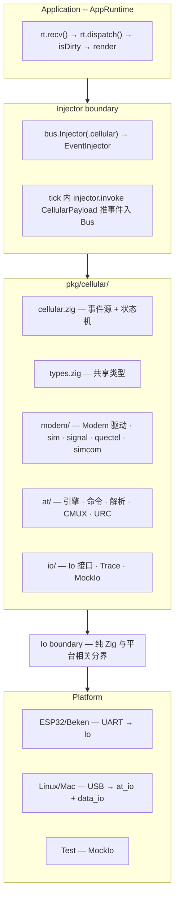
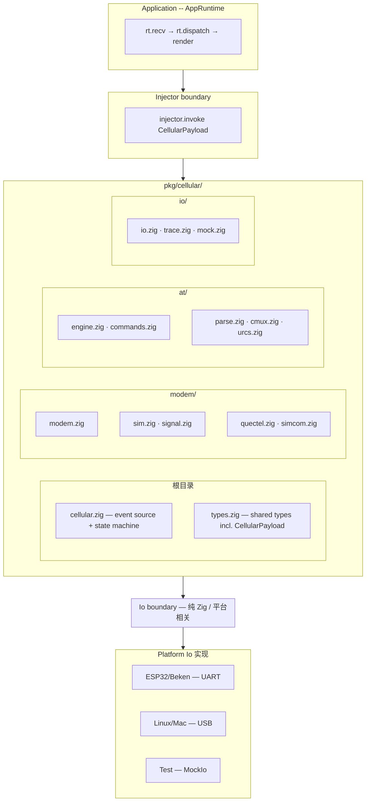
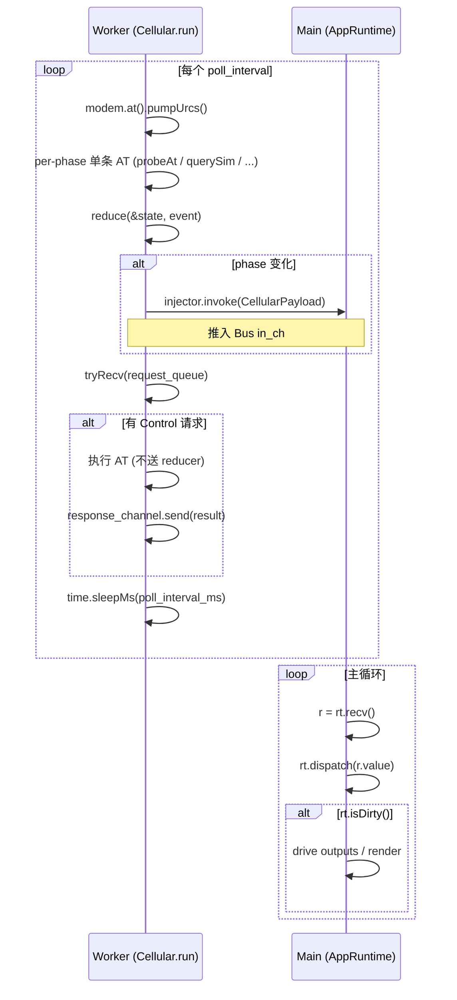

# pkg/cellular 开发设计文档（cellular_dev）

> 本文档是 **pkg/cellular** 模块的单一事实来源，供多工程师按目录树分层实现与验收。
> 来源：plan.md（设计规格 + 实施步骤）+ plan-review.md（拍板决策与实现细节回填）。

---

## 目录

1. [文档说明与目标](#1-文档说明与目标)
2. [架构总览](#2-架构总览)
3. [目录树与按层级的设计文档](#3-目录树与按层级的设计文档)
4. [实施顺序与通过标准](#4-实施顺序与通过标准)
5. [已拍板决策汇总](#5-已拍板决策汇总)
6. [实现中若遇不明确处](#6-实现中若遇不明确处)
7. [用法示例](#7-用法示例)

---

## 1. 文档说明与目标

- **读者**：实现 cellular 的工程师（可能多人并行）。
- **目标**：按本文档可独立完成各层实现与单测/烧录验证，无需反复查阅 plan.md / plan-review.md。
- **约定**：所有「实现细节」来自 plan 的 Open Question 结论与 plan-review 的拍板项，已回填到对应模块小节。若在实现某模块时发现规格不清或冲突，**先停下来在 6 中记录并询问**，再继续。

---

## 2. 架构总览

### 2.1 架构图（高层）



### 2.2 层级图（与目录一一对应）



### 2.3 事件流（Worker vs Main）



Worker 还处理 Control 请求：每次 tick 之后 tryRecv(request_queue)，执行后写 response，不送 reducer。

### 2.4 运行模式（Modem）

- **Single-channel**：只提供 io，内部 CMUX 拆 AT + PPP。
- **Multi-channel**：提供 at_io + data_io，不用 CMUX。自动判定：data_io != null 即 multi。

### 2.5 Runtime 合约（Thread / Notify / Time）

来自 runtime/thread.zig、runtime/sync/notify.zig、runtime/time.zig；comptime 注入。

**Thread（runtime/thread.zig）**：spawn/join/detach。TaskFn = `*const fn (?*anyopaque) void`；SpawnConfig 含 stack_size、priority、name 等。用途：Cellular worker 线程、CMUX pump 线程。

**Notify（runtime/sync/notify.zig）**：init/deinit/signal/wait/timedWait。用途：CMUX 各虚拟通道的数据到达通知。

**Time（runtime/time.zig）**：nowMs/sleepMs。用途：AtEngine 超时循环、tick 间隔；测试用 FakeTime。

**Channel（runtime/channel_factory.zig）**：request_queue 和 response_channel 用 channel_factory 生成。request_queue capacity=4，response_channel capacity=1。

---

## 3. 目录树与按层级的设计文档

```
src/pkg/cellular/
├── types.zig              shared types + CellularEvent (no logic, no deps)
├── cellular.zig           event source + Control — owns Modem, Injector, request_queue, response_channel
├── io/
│   ├── io.zig             generic Io interface + fromUart/fromSpi
│   ├── trace.zig          TraceIo decorator (logs read/write bytes)
│   └── mock.zig           MockIo (linear buffers, test only)
├── at/
│   ├── engine.zig         AT command engine (sendRaw/send/pumpUrcs)
│   ├── commands.zig       typed AT command definitions (comptime structs)
│   ├── parse.zig          AT response parsing (pure functions)
│   ├── cmux.zig           GSM 07.10 CMUX framing
│   └── urcs.zig           typed URC definitions (comptime structs)
├── modem/
│   ├── modem.zig          hardware driver — owns Io/CMUX/AtEngine, NO state machine
│   ├── sim.zig            SIM card management (uses AtEngine)
│   ├── signal.zig         signal quality monitoring (uses AtEngine)
│   ├── quectel.zig        Quectel module profile
│   ├── simcom.zig         SIMCom module profile
│   └── quectel_stub.zig   Step 8 占位 Module
├── voice.zig              voice call management (phase 2)
└── apn.zig                APN auto-resolve (phase 2)
```

### 3.1 types.zig — 共享类型

所有共享类型。无逻辑，无依赖。

```zig
Phase = enum { off, starting, ready, sim_ready, registered, dialing, connected, error };
SimStatus = enum { not_inserted, pin_required, puk_required, ready, error };
NetworkType = enum { none, gsm, gprs, edge, umts, hsdpa, lte };
RegistrationStatus = enum { not_registered, registered_home, searching, denied, registered_roaming, unknown };
CallState = enum { idle, incoming, dialing, alerting, active };

SignalInfo = struct {
    rssi: i8,
    ber: ?u8,
    rsrp: ?i16,
    rsrq: ?i8,
};

ModemInfo = struct {
    imei: [15]u8,    imei_len: u8,
    model: [32]u8,   model_len: u8,
    firmware: [32]u8, firmware_len: u8,
    pub fn getImei(self: *const @This()) []const u8;
    pub fn getModel(self: *const @This()) []const u8;
    pub fn getFirmware(self: *const @This()) []const u8;
};

SimInfo = struct {
    status: SimStatus,
    imsi: [15]u8,  imsi_len: u8,
    iccid: [20]u8, iccid_len: u8,
    pub fn getImsi(self: *const @This()) []const u8;
    pub fn getIccid(self: *const @This()) []const u8;
};

ModemError = enum {
    at_timeout, at_fatal, sim_not_inserted, sim_pin_required, sim_error,
    cmux_failed, registration_denied, registration_failed, ppp_failed, config_failed,
};

ModemState = struct {
    phase: Phase = .off,
    sim: SimStatus = .not_inserted,
    registration: RegistrationStatus = .not_registered,
    network_type: NetworkType = .none,
    signal: ?SignalInfo = null,
    modem_info: ?ModemInfo = null,
    sim_info: ?SimInfo = null,
    error_reason: ?ModemError = null,
    at_timeout_count: u8 = 0,
};

ModemEvent = union(enum) {
    power_on: void,
    power_off: void,
    at_ready: void,
    at_timeout: void,
    sim_ready: void,
    sim_error: SimStatus,
    sim_removed: void,
    pin_required: void,
    registered: RegistrationStatus,
    registration_failed: RegistrationStatus,
    dial_start: void,
    dial_connected: void,
    dial_failed: void,
    ip_obtained: void,
    ip_lost: void,
    signal_updated: SignalInfo,
    retry: void,
    stop: void,
};

ConnectConfig = struct {
    apn: []const u8,
    username: []const u8 = "",
    password: []const u8 = "",
};

ChannelRole = enum { at, ppp };
ChannelConfig = struct { dlci: u8, role: ChannelRole };

ModemConfig = struct {
    cmux_channels: []const ChannelConfig = &.{
        .{ .dlci = 1, .role = .ppp },
        .{ .dlci = 2, .role = .at },
    },
    cmux_baud_rate: u32 = 921600,
    at_timeout_ms: u32 = 5000,
    max_urc_handlers: u8 = 16,
    context_id: u8 = 1,
};
```

**Control 类型**（`ControlRequestTag`、`ControlRequest`、`ControlResponse` 等）在 [§3.15 CellularControl](#315-cellularcontrol--用户侧控制句柄) 中定义，实现时放在 types.zig 或 cellular.zig 内导出。

### 测试用例 — types_test.zig（3 tests）

| ID | 测试名称 | 验证内容 |
|----|---------|---------|
| TY-01 | ModemState default | phase=.off, sim=.not_inserted |
| TY-02 | ModemInfo getters | getImei/getModel/getFirmware 切片正确性 |
| TY-03 | SimInfo getters | getImsi/getIccid 切片正确性 |

---

### 3.2 io/io.zig — 类型擦除读写接口

通用传输抽象。`read()` 非阻塞：无数据时返回 `WouldBlock`。调用方使用 `poll(timeout_ms)` 等待数据。

| Io 类型 | pollFn 实现 |
|---------|------------|
| UART (ESP32/Beken) | 硬件中断 + RTOS 信号量 |
| USB serial (Linux/Mac) | POSIX `poll()` 系统调用 |
| CMUX virtual channel | `Notify.timedWait()`（由 pump 线程信号触发） |
| MockIo (test) | 检查 rx 有未读数据，忽略 timeout |

```zig
pub const IoError = error{ WouldBlock, Timeout, Closed, IoError };

pub const PollFlags = packed struct {
    readable: bool = false,
    writable: bool = false,
    _padding: u6 = 0,
};

pub const Io = struct {
    ctx: *anyopaque,
    readFn: *const fn (*anyopaque, []u8) IoError!usize,
    writeFn: *const fn (*anyopaque, []const u8) IoError!usize,
    pollFn: *const fn (*anyopaque, i32) PollFlags,

    pub fn read(self: Io, buf: []u8) IoError!usize;
    pub fn write(self: Io, buf: []const u8) IoError!usize;
    pub fn poll(self: Io, timeout_ms: i32) PollFlags;
};

pub fn fromUart(comptime UartType: type, ptr: *UartType) Io;
pub fn fromSpi(comptime SpiType: type, ptr: *SpiType) Io;
```

### 测试用例 — io/io_test.zig（3 tests）

| ID | 测试名称 | 验证内容 |
|----|---------|---------|
| IO-01 | Io round-trip | write → read 通过 mock-backed Io 传输 |
| IO-02 | fromUart | UART HAL 包装为 Io，read/write 透传 |
| IO-03 | WouldBlock | 空读返回 WouldBlock |

---

### 3.3 io/trace.zig — TraceIo 装饰器

包装任意 `Io`，通过用户提供的 log 函数记录所有读写字节。零侵入：插入任意 Io 与其消费者之间无需修改代码。

```zig
pub const TraceDirection = enum { tx, rx };
pub const TraceFn = *const fn (TraceDirection, []const u8) void;

pub fn wrap(inner: Io, log_fn: TraceFn) Io;
```

**实现要点：**
- `readFn`：调用 `inner.read()`，然后 `log_fn(.rx, data[0..n])`
- `writeFn`：`log_fn(.tx, buf)`，然后 `inner.write(buf)`
- `pollFn`：直接委托 `inner.poll()`（无需日志）

**使用示例：**

```zig
const raw_io = io.fromUart(uart_hal, &uart);
const traced = trace.wrap(raw_io, myLogFn);
var modem = Modem.init(.{ .io = traced, ... });
```

### 测试用例 — io/trace_test.zig（4 tests）

| ID | 测试名称 | 验证内容 |
|----|---------|---------|
| TR-01 | trace write | wrap(mock).write("AT\r") → log_fn 收到 (.tx, "AT\r") |
| TR-02 | trace read | wrap(mock).read() → log_fn 收到 (.rx, data) |
| TR-03 | trace passthrough | 数据不经修改透传到内层 Io |
| TR-04 | trace poll | poll 委托内层，不触发 log 调用 |

---

### 3.4 io/mock.zig — MockIo 测试传输

通用测试传输。采用两段线性 buffer，无 RingBuffer 依赖。

- **发端 (tx)**：`tx_buf + tx_len`，write 追加；`sent()` 返回已写数据；`drain()` 清零。
- **收端 (rx)**：`rx_buf + rx_len + rx_pos`，测试侧 `feed(bytes)` 注入响应；read 从 rx_pos 读取；无数据返回 WouldBlock。

```zig
MockIo(capacity):
    tx_buf: [capacity]u8
    tx_len: usize = 0
    rx_buf: [capacity]u8
    rx_len: usize = 0
    rx_pos: usize = 0

    pub fn init(comptime capacity: usize) MockIo(capacity);
    pub fn io(self: *MockIo) Io;

    // 测试辅助
    pub fn feed(self: *MockIo, bytes: []const u8) void;
    pub fn sent(self: *MockIo) []const u8;
    pub fn drain(self: *MockIo) void;

    // 序列辅助：预填多步响应
    pub fn feedSequence(self: *MockIo, responses: []const []const u8) void;
```

**设计决策：** 移除 onSend() 自动应答，只保留 FIFO feed()。tick() 按 phase 每次只发一条 AT，FIFO 即可覆盖所有场景。

---

### 3.5 at/parse.zig — 纯解析函数

纯函数。无状态，无 IO，仅依赖 types.zig。独立可测试。

```zig
pub fn isOk(line: []const u8) bool;
pub fn isError(line: []const u8) bool;
pub fn parseCmeError(line: []const u8) ?u16;
pub fn parseCmsError(line: []const u8) ?u16;
pub fn parsePrefix(line: []const u8, prefix: []const u8) ?[]const u8;
pub fn parseCsq(value: []const u8) ?SignalInfo;
pub fn parseCpin(value: []const u8) ?SimStatus;
pub fn parseCreg(value: []const u8) ?RegistrationStatus;
pub fn rssiToDbm(csq: u8) i8;
pub fn rssiToPercent(dbm: i8) u8;
```

### 测试用例 — at/parse_test.zig（11 tests）

| ID | 测试名称 | 验证内容 |
|----|---------|---------|
| AP-01 | isOk | "OK"→true, "ERROR"→false |
| AP-02 | isError | "ERROR"→true, "+CME ERROR: 10"→false |
| AP-03 | parseCmeError | "+CME ERROR: 10"→10 |
| AP-04 | parseCmsError | "+CMS ERROR: 500"→500 |
| AP-05 | parsePrefix | "+CSQ: 20,0" with "+CSQ:" → "20,0" |
| AP-06 | parseCsq | "20,0" → rssi=-73, ber=0 |
| AP-07 | parseCsq no signal | "99,99" → null |
| AP-08 | parseCpin | "READY"→.ready, "SIM PIN"→.pin_required |
| AP-09 | parseCreg | "0,1"→.registered_home, "0,5"→.registered_roaming |
| AP-10 | rssiToDbm | 20→-73, 0→-113, 31→-51 |
| AP-11 | rssiToPercent | -50→100, -110→0, -80→50 |

---

### 3.6 at/commands.zig — 类型化 AT 命令定义

每个命令是带 comptime 元数据和 write/parse 方法的 struct。灵感来源于 Rust `atat` crate。

**命令契约：**

| 字段/方法 | 类型 | 描述 |
|----------|------|------|
| `Response` | `type` (comptime) | 解析后的响应类型 |
| `prefix` | `[]const u8` (comptime) | 响应行匹配前缀 |
| `timeout_ms` | `u32` (comptime) | 命令特定超时 |
| `write(buf)` 或 `write(self, buf)` | `fn → usize` | 序列化命令到缓冲区 |
| `parseResponse(line)` | `fn → ?Response` | 解析响应行 |
| `match(line)` | `fn → enum{complete,need_more,unknown}` | *(可选)* 自定义响应完整性匹配 |

**命令分类一览：**

```zig
// 1. General (V.25ter / 3GPP 27.007 Ch4)
pub const Probe = struct { ... };               // "AT\r"
pub const GetManufacturer = struct { ... };      // "AT+CGMI\r"
pub const GetModel = struct { ... };             // "AT+CGMM\r"
pub const GetFirmwareVersion = struct { ... };   // "AT+CGMR\r"
pub const GetImei = struct { ... };              // "AT+CGSN\r"

// 2. Control (V.25ter / 3GPP 27.007 Ch5)
pub const SetEcho = struct { enable: bool, ... };         // "ATE0\r" / "ATE1\r"
pub const SetErrorFormat = struct { level: u8, ... };     // "AT+CMEE=<level>\r"

// 3. SIM / Device Lock (3GPP 27.007 Ch8-9)
pub const GetSimStatus = struct { ... };         // "AT+CPIN?\r"
pub const EnterPin = struct { pin: []const u8, ... };  // "AT+CPIN=<pin>\r"
pub const GetImsi = struct { ... };              // "AT+CIMI\r"
pub const GetIccid = struct { ... };             // "AT+CCID\r"

// 4. Mobile Control (3GPP 27.007 Ch6)
pub const SetFunctionality = struct { level: u8, ... };  // "AT+CFUN=<level>\r"

// 5. Network Service (3GPP 27.007 Ch7)
pub const GetSignalQuality = struct { ... };     // "AT+CSQ\r"
pub const GetRegistration = struct { ... };      // "AT+CGREG?\r"
pub const SetRegistrationUrc = struct { mode: u8, ... }; // "AT+CGREG=<mode>\r"

// 6. PDP / Packet Domain (3GPP 27.007 Ch10)
pub const SetApn = struct { cid: u8, apn: []const u8, ... };  // "AT+CGDCONT=..."
pub const GetAttachStatus = struct { ... };      // "AT+CGATT?\r"

// 7. Call Control (V.25ter / 3GPP 27.007 Ch6-7)
pub const Dial = struct { ... };     // "ATD*99***1#\r" — 含自定义 match（CONNECT/NO CARRIER/BUSY）
pub const Hangup = struct { ... };   // "ATH\r"

// 9. CMUX / Multiplexer (3GPP 27.010)
pub const SetCmux = struct { ... };  // "AT+CMUX=0\r"
```

**典型命令 struct 示例（GetSignalQuality）：**

```zig
pub const GetSignalQuality = struct {
    pub const Response = types.SignalInfo;
    pub const prefix = "+CSQ";
    pub const timeout_ms: u32 = 5000;
    pub fn write(buf: []u8) usize {
        const cmd = "AT+CSQ\r";
        @memcpy(buf[0..cmd.len], cmd);
        return cmd.len;
    }
    pub fn parseResponse(line: []const u8) ?Response {
        const value = parse.parsePrefix(line, "+CSQ: ") orelse return null;
        return parse.parseCsq(value);
    }
};
```

**自定义 match 示例（Dial）：**

```zig
pub const Dial = struct {
    pub const Response = void;
    pub const prefix = "";
    pub const timeout_ms: u32 = 30000;
    apn: []const u8,
    pub fn write(self: Dial, buf: []u8) usize { ... }
    pub fn parseResponse(_: []const u8) ?Response { return {}; }

    pub const MatchResult = enum { complete, need_more, unknown };
    pub fn match(line: []const u8) MatchResult {
        if (std.mem.startsWith(u8, line, "CONNECT")) return .complete;
        if (std.mem.startsWith(u8, line, "NO CARRIER")) return .complete;
        if (std.mem.startsWith(u8, line, "BUSY")) return .complete;
        return .unknown;
    }
};
```

### 测试用例 — at/commands_test.zig（8 tests）

| ID | 测试名称 | 验证内容 |
|----|---------|---------|
| AC-01 | GetSignalQuality write | write() 产生 "AT+CSQ\r" |
| AC-02 | GetSignalQuality parse | parseResponse("+CSQ: 20,0") → SignalInfo{rssi=-73} |
| AC-03 | GetSimStatus write | write() 产生 "AT+CPIN?\r" |
| AC-04 | GetSimStatus parse | parseResponse("+CPIN: READY") → .ready |
| AC-05 | EnterPin write | .{.pin="1234"}.write() 产生 "AT+CPIN=1234\r" |
| AC-06 | GetRegistration parse | parseResponse("+CGREG: 0,1") → .registered_home |
| AC-07 | comptime contract | 缺少 Response 的 Cmd → 编译错误 |
| AC-08 | typed send round-trip | MockIo + engine.send(GetSignalQuality, .{}) → 类型化结果 |

---

### 3.7 at/engine.zig — AT 命令引擎

通过 Io 读写。传输无关。时间通过 comptime 泛型注入（测试用 FakeTime，ESP32 用真实 Time）。

```zig
pub const AtStatus = enum { ok, error, cme_error, cms_error, timeout, overflow };

pub const UrcHandler = struct {
    prefix: []const u8,
    ctx: ?*anyopaque,
    callback: *const fn (?*anyopaque, []const u8) void,
};

pub fn AtEngine(comptime Time: type, comptime buf_size: usize) type {
    return struct {
        const Self = @This();

        pub const AtResponse = struct {
            status: AtStatus,
            body: []const u8,       // 响应正文（指向 rx_buf 内的切片）
            error_code: ?u16,
            pub fn lineIterator(self: *const @This()) LineIterator;
        };

        pub const LineIterator = struct {
            data: []const u8,
            pos: usize = 0,
            pub fn next(self: *LineIterator) ?[]const u8;
        };

        io: Io,
        time: Time,
        rx_buf: [buf_size]u8,
        rx_pos: usize,
        urc_handlers: [16]?UrcHandler,

        pub fn init(io: Io, time: Time) Self;
        pub fn setIo(self: *Self, io: Io) void;

        // Raw send：非类型化，用于底层/自定义命令
        pub fn sendRaw(self: *Self, cmd: []const u8, timeout_ms: u32) AtResponse;

        // Raw send with custom matcher
        const MatchFn = *const fn ([]const u8) enum { complete, need_more, unknown };
        pub fn sendRawWithMatcher(self: *Self, cmd: []const u8, timeout_ms: u32, matcher: MatchFn) AtResponse;

        // Typed send：comptime 命令类型，返回类型化结果
        pub fn send(self: *Self, comptime Cmd: type, cmd: anytype) SendResult(Cmd);

        pub fn SendResult(comptime Cmd: type) type {
            return struct {
                status: AtStatus,
                raw: AtResponse,
                value: ?Cmd.Response,
            };
        }

        pub fn registerUrc(self: *Self, prefix: []const u8, handler: UrcHandler) bool;
        pub fn unregisterUrc(self: *Self, prefix: []const u8) void;
        pub fn pumpUrcs(self: *Self) void;

        // 类型化 URC pump（配合 at/urcs.zig）
        pub fn pumpUrcsTyped(self: *Self, comptime Urcs: anytype, ctx: anytype) void;
    };
}
```

**使用对比：**

```zig
// Before（非类型化）：
const resp = at.sendRaw("AT+CSQ\r", 5000);
const line = resp.firstLine() orelse return error.NoResponse;
const value = parse.parsePrefix(line, "+CSQ: ") orelse return error.ParseError;
const signal = parse.parseCsq(value) orelse return error.ParseError;

// After（类型化）：
const result = at.send(commands.GetSignalQuality, .{});
if (result.value) |signal| { ... }  // signal 是 SignalInfo，编译时保证
```

### 测试用例 — at/engine_test.zig（11 tests，使用 MockIo）

| ID | 测试名称 | 验证内容 |
|----|---------|---------|
| AT-01 | basic OK | "AT\r" 发送 → "\r\nOK\r\n" → status=ok |
| AT-02 | response with data | "+CSQ: 20,0\r\nOK\r\n" → 行已解析 |
| AT-03 | ERROR | "ERROR\r\n" → status=error |
| AT-04 | CME ERROR | "+CME ERROR: 10\r\n" → code=10 |
| AT-05 | timeout | 无响应 → status=timeout |
| AT-06 | URC idle | 注册前缀 → feed URC → pumpUrcs → 回调被调用 |
| AT-07 | URC interleaved | URC 混在响应中 → 两者均正确处理 |
| AT-08 | partial reassembly | "O" 然后 "K\r\n" → 完整响应 |
| AT-09 | multi-line | 4 行 + OK → 全部捕获 |
| AT-10 | setIo swap | Io A → 换成 B → 路由正确 |
| AT-11 | multiple URCs | 3 个前缀 → 正确分派 |

---

### 3.8 at/cmux.zig — GSM 07.10 CMUX 复用

仅在 Modem 单通道模式下使用。Pump 运行于独立线程，每个虚拟通道有 Notify 信号。

```zig
pub const Frame = struct {
    dlci: u8,
    control: u8,
    data: []const u8,
};

pub fn Cmux(comptime Thread: type, comptime Notify: type, comptime max_channels: u8) type {
    return struct {
        const Self = @This();
        io: Io,
        channels: [max_channels]ChannelBuf,
        notifiers: [max_channels]Notify,
        active: bool,
        pump_thread: ?Thread,

        pub fn init(io: Io) Self;
        pub fn open(self: *Self, dlcis: []const u8) !void;
        pub fn close(self: *Self) void;
        pub fn channelIo(self: *Self, dlci: u8) ?Io;
        pub fn startPump(self: *Self) !void;
        pub fn stopPump(self: *Self) void;
        pub fn pump(self: *Self) void;

        pub fn encodeFrame(frame: Frame, out: []u8) usize;
        pub fn decodeFrame(data: []const u8) ?Frame;
        pub fn calcFcs(data: []const u8) u8;
    };
}
```

**可配置通道（R41）：** 用户通过 `ModemConfig.cmux_channels` 指定各 DLCI 与角色。`init` 时校验恰好一个 `.at` 和一个 `.ppp`，DLCI 不重复且在有效范围内。`enterCmux` 从配置获取 DLCI 列表用于 SABM/UA 握手。

### 测试用例 — at/cmux_test.zig（10 tests，使用 MockIo）

| ID | 测试名称 | 验证内容 |
|----|---------|---------|
| MX-01 | UIH encode | data → GSM 07.10 字节序列 |
| MX-02 | UIH decode | 原始字节 → Frame { dlci, payload } |
| MX-03 | SABM/UA handshake | open() → SABM 发送 → feed UA → 成功 |
| MX-04 | channel write | channelIo(2).write("AT") → UIH DLCI=2 |
| MX-05 | channel read | feed UIH DLCI=2 → channelIo(2).read → 数据 |
| MX-06 | channel isolation | DLCI 1 数据不出现在 DLCI 2 |
| MX-07 | DISC/close | close() → 发送 DISC 帧 |
| MX-08 | FCS | 已知 GSM 07.10 向量 |
| MX-09 | concurrent | 交错 DLCI 1+2 → 正确复用 |
| MX-10 | pump demux | 混合帧 → 正确通道缓冲 |

---

### 3.9 at/urcs.zig — 类型化 URC 定义

类型化 URC（非请求结果码）定义。与命令类型 struct 统一模式。

**URC 契约：**

| 字段/方法 | 类型 | 描述 |
|----------|------|------|
| `prefix` | `[]const u8` (comptime) | URC 行匹配前缀 |
| `parse(line)` | `fn → ?Payload` | 解析 URC 行为类型化载荷 |

```zig
pub const NetworkRegistrationUrc = struct {
    pub const Payload = types.RegistrationStatus;
    pub const prefix = "+CREG";
    pub fn parseUrc(line: []const u8) ?Payload { ... }
};

pub const SimStatusUrc = struct {
    pub const Payload = types.SimStatus;
    pub const prefix = "+CPIN";
    pub fn parseUrc(line: []const u8) ?Payload { ... }
};

pub const SimHotplugUrc = struct {
    pub const Payload = struct { sim_inserted: bool };
    pub const prefix = "+QSIMSTAT";
    pub fn parseUrc(line: []const u8) ?Payload { ... }
};

pub const RingUrc = struct {
    pub const Payload = void;
    pub const prefix = "+CRING";
    pub fn parseUrc(_: []const u8) ?Payload { return {}; }
};

pub const AllUrcs = .{
    NetworkRegistrationUrc,
    SimStatusUrc,
    SimHotplugUrc,
    RingUrc,
};
```

### 测试用例 — at/urcs_test.zig（5 tests）

| ID | 测试名称 | 验证内容 |
|----|---------|---------|
| UC-01 | NetworkRegistrationUrc parse | "+CREG: 0,1" → .registered_home |
| UC-02 | SimHotplugUrc parse | "+QSIMSTAT: 1,1" → sim_inserted=true |
| UC-03 | RingUrc parse | "+CRING: VOICE" → void payload |
| UC-04 | prefix mismatch | 错误前缀 → null |
| UC-05 | pumpUrcsTyped dispatch | feed 多个 URC → 正确类型化回调 |

---

### 3.10 modem/modem.zig — 硬件驱动

拥有传输层、CMUX、AT 引擎。**无 flux Store，无状态机。**

```zig
pub fn Modem(
    comptime Thread: type,
    comptime Notify: type,
    comptime Time: type,
    comptime Module: type,
    comptime Gpio: type,
    comptime at_buf_size: usize,
) type {
    const At = AtEngine(Time, at_buf_size);
    const CmuxType = Cmux(Thread, Notify, 4);

    return struct {
        const Self = @This();

        pub const PowerPins = struct {
            power_pin: ?u8 = null,
            reset_pin: ?u8 = null,
            vint_pin: ?u8 = null,
        };

        pub const InitConfig = struct {
            io: ?Io = null,           // 单通道模式
            at_io: ?Io = null,        // 多通道模式
            data_io: ?Io = null,
            time: Time,
            gpio: ?*Gpio = null,
            pins: PowerPins = .{},
            set_rate: ?*const fn (u32) anyerror!void = null,
            config: ModemConfig = .{},
        };

        gpio: ?*Gpio,
        pins: PowerPins,
        mode: enum { single_channel, multi_channel },
        raw_io: ?Io,
        cmux: ?CmuxType,
        at_engine: At,
        data_io: ?Io,
        config: ModemConfig,
        time: Time,

        pub fn init(cfg: InitConfig) Self;
        pub fn deinit(self: *Self) void;

        // 电源控制
        pub fn powerUp(self: *Self) !void;
        pub fn powerDown(self: *Self) void;
        pub fn hardReset(self: *Self) !void;
        pub fn isPowered(self: *Self) ?bool;

        // AT 通道
        pub fn at(self: *Self) *At;

        // PPP 数据 IO
        pub fn pppIo(self: *Self) ?Io;

        // CMUX 生命周期（仅单通道模式）
        pub fn enterCmux(self: *Self) !void;
        pub fn exitCmux(self: *Self) void;
        pub fn isCmuxActive(self: *const Self) bool;

        // 数据模式
        pub fn enterDataMode(self: *Self) !void;
        pub fn exitDataMode(self: *Self) void;
    };
}
```

### 测试用例 — modem/modem_test.zig（13 tests，无状态机）

| ID | 测试名称 | 验证内容 |
|----|---------|---------|
| MD-01 | single-ch init | 仅提供 .io → single_channel 模式 |
| MD-02 | multi-ch init | .at_io + .data_io → multi_channel 模式 |
| MD-03 | invalid init | 未提供 io 也未提供 at_io → 错误 |
| MD-04 | single-ch AT | at().send("AT") → 字节发往 raw Io |
| MD-05 | multi-ch AT | at().send("AT") → 字节仅发往 at_io |
| MD-06 | multi-ch PPP | pppIo().write → 字节仅发往 data_io |
| MD-07 | multi-ch pppIo available | pppIo() 立即非 null |
| MD-08 | single-ch enterCmux | AT+CMUX=0 发送，SABM/UA，Io 切换 |
| MD-09 | single-ch CMUX AT | CMUX 后 at().send → CMUX DLCI 2 |
| MD-10 | single-ch CMUX PPP | CMUX 后 pppIo() → CMUX DLCI 1 |
| MD-11 | single-ch exitCmux | DISC 发送，AT 恢复 raw Io |
| MD-12 | multi-ch enterCmux noop | 多通道模式 enterCmux() 为 no-op |
| MD-13 | enterDataMode | ATD*99# → CONNECT → pppIo 激活 |

---

### 3.11 modem/sim.zig — SIM 卡管理

通过 AtEngine 发送 AT 命令管理 SIM 卡。

```zig
pub const Sim = struct {
    at: *AtEngine,

    pub fn init(at_engine: *AtEngine) Sim;
    pub fn getStatus(self: *Sim) !SimStatus;
    pub fn getImsi(self: *Sim) !SimInfo;
    pub fn getIccid(self: *Sim) !SimInfo;
    pub fn enterPin(self: *Sim, pin: []const u8) !void;
    pub fn enableHotplug(self: *Sim) !void;
    pub fn registerUrcs(self: *Sim, dispatch_ctx: anytype) void;
};
```

### 测试用例 — modem/sim_test.zig（7 tests）

| ID | 测试名称 | 验证内容 |
|----|---------|---------|
| SM-01 | SIM ready | AT+CPIN? → "+CPIN: READY" → .ready |
| SM-02 | not inserted | → "+CME ERROR: 10" → .not_inserted |
| SM-03 | PIN required | → "+CPIN: SIM PIN" → .pin_required |
| SM-04 | IMSI | AT+CIMI → "460001234567890" |
| SM-05 | ICCID | AT+QCCID → "+QCCID: 89860..." |
| SM-06 | hotplug URC | "+QSIMSTAT: 0,0" → removal |
| SM-07 | PIN entry | "AT+CPIN=1234\r" 发送 → OK |

---

### 3.12 modem/signal.zig — 信号质量监控

通过 AtEngine 发送 AT 命令监控信号质量。

```zig
pub const Signal = struct {
    at: *AtEngine,

    pub fn init(at_engine: *AtEngine) Signal;
    pub fn getStrength(self: *Signal) !SignalInfo;
    pub fn getRegistration(self: *Signal) !RegistrationStatus;
    pub fn getNetworkType(self: *Signal) !NetworkType;
};
```

### 测试用例 — modem/signal_test.zig（7 tests）

| ID | 测试名称 | 验证内容 |
|----|---------|---------|
| SG-01 | CSQ | "+CSQ: 20,0" → rssi=-73 |
| SG-02 | no signal | "+CSQ: 99,99" → null |
| SG-03 | LTE quality | AT+QCSQ → rsrp/rsrq |
| SG-04 | reg home | "+CGREG: 0,1" → registered_home |
| SG-05 | reg roaming | "+CEREG: 0,5" → registered_roaming |
| SG-06 | reg denied | "+CGREG: 0,3" → denied |
| SG-07 | network type | AT+QNWINFO → .lte |

---

### 3.13 modem/quectel.zig & simcom.zig — 模组特定命令

模组特定的命令/URC/init-sequence 命名空间。每个文件导出标准声明集，供 `Modem(comptime Module)` 在编译时消费。

**Module 命名空间契约（duck-typed，Modem comptime 检查）：**

| 导出 | 类型 | 描述 |
|-----|------|------|
| `commands` | namespace | 模组特定 AT 命令 struct |
| `urcs` | namespace | 模组特定 URC struct |
| `init_sequence` | `[]const type` | 模组初始化命令的有序列表 |

```zig
// modem/quectel.zig
pub const commands = struct {
    pub const SetNetworkCategory = struct {
        pub const Response = void;
        pub const prefix = "";
        pub const timeout_ms: u32 = 5000;
        pub fn write(buf: []u8) usize { ... }
        pub fn parseResponse(_: []const u8) ?Response { return {}; }
    };
    pub const GetModuleInfo = struct {
        pub const Response = types.ModemInfo;
        pub const prefix = "+QGMR";
        pub const timeout_ms: u32 = 3000;
        pub fn write(buf: []u8) usize { ... }
        pub fn parseResponse(line: []const u8) ?Response { ... }
    };
};

pub const urcs = struct {
    pub const PowerDown = struct {
        pub const Payload = void;
        pub const prefix = "POWERED DOWN";
        pub fn parseUrc(_: []const u8) ?Payload { return {}; }
    };
};

pub const init_sequence = &[_]type{
    base_cmds.Probe,
    commands.SetNetworkCategory,
    base_cmds.GetSimStatus,
    base_cmds.GetRegistration,
};
```

### 测试用例 — modem/quectel_test.zig（4 tests）

| ID | 测试名称 | 验证内容 |
|----|---------|---------|
| QC-01 | Quectel command write | SetNetworkCategory.write() 产生正确字节 |
| QC-02 | Quectel command parse | GetModuleInfo.parseResponse() 解析 Quectel 格式 |
| QC-03 | Quectel URC parse | PowerDown.parseUrc("POWERED DOWN") → .{} |
| QC-04 | init_sequence order | init_sequence 按预期顺序包含命令类型 |

### 测试用例 — modem/simcom_test.zig（4 tests）

| ID | 测试名称 | 验证内容 |
|----|---------|---------|
| SC-01 | SIMCom command write | 模组特定命令产生正确字节 |
| SC-02 | SIMCom command parse | 模组特定响应正确解析 |
| SC-03 | SIMCom URC parse | 模组特定 URC 正确解析 |
| SC-04 | init_sequence order | init_sequence 按预期顺序包含命令类型 |

---

### 3.14 cellular.zig — 事件源 + 状态机

拥有 Modem、EventInjector(CellularPayload)、worker 线程。与 main 分支 Bus 对齐：不持有 Channel，由应用在 init 时传入 injector。

```zig
pub fn Cellular(
    comptime Thread: type,
    comptime Notify: type,
    comptime Time: type,
    comptime Module: type,
    comptime Gpio: type,
    comptime at_buf_size: usize,
) type {
    const ModemType = Modem(Thread, Notify, Time, Module, Gpio, at_buf_size);
    const SimType = Sim(Time);
    const SignalType = Signal(Time);
    const InjectorType = EventInjector(CellularPayload);

    return struct {
        const Self = @This();

        pub const Config = struct {
            poll_interval_ms: u32 = 1000,
            thread_stack_size: usize = 8192,
        };

        modem: ModemType,
        sim: SimType,
        signal: SignalType,
        injector: InjectorType,
        config: Config,
        state: ModemState,
        worker: ?Thread = null,
        running: std.atomic.Value(bool) = std.atomic.Value(bool).init(false),

        pub fn init(allocator: std.mem.Allocator, modem_cfg: ModemType.InitConfig, injector: InjectorType, config: Config) !Self;
        pub fn deinit(self: *Self) void;
        pub fn start(self: *Self) !void;
        pub fn stop(self: *Self) void;
        pub fn isRunning(self: *const Self) bool;

        fn workerMain(ctx: ?*anyopaque) void;
        fn tick(self: *Self) void;
        fn reduce(state: *ModemState, event: ModemEvent) void;
        fn emitIfChanged(self: *Self, old_phase: Phase) void;
    };
}
```

**reduce() 完整伪代码：**

```zig
fn reduce(state: *ModemState, event: ModemEvent) void {
    switch (state.phase) {
        .off => switch (event) {
            .power_on => state.phase = .starting,
            else => {},
        },
        .starting => switch (event) {
            .at_ready   => { state.at_timeout_count = 0; state.phase = .ready; },
            .at_timeout => {
                state.at_timeout_count += 1;
                if (state.at_timeout_count >= 3) {
                    state.error_reason = .at_timeout;
                    state.phase = .error;
                }
            },
            .stop => state.phase = .off,
            else => {},
        },
        .ready => switch (event) {
            .sim_ready  => state.phase = .sim_ready,
            .sim_error  => |s| { state.sim = s; state.error_reason = .sim_error; state.phase = .error; },
            .stop       => state.phase = .off,
            else => {},
        },
        .sim_ready => switch (event) {
            .registered          => |r| { state.registration = r; state.phase = .registered; },
            .registration_failed => |r| { state.registration = r; state.error_reason = .registration_failed; state.phase = .error; },
            .sim_removed         => { state.sim = .not_inserted; state.phase = .ready; },
            .stop                => state.phase = .off,
            else => {},
        },
        .registered => switch (event) {
            .dial_start  => state.phase = .dialing,
            .sim_removed => { state.sim = .not_inserted; state.phase = .ready; },
            .stop        => state.phase = .off,
            else => {},
        },
        .dialing => switch (event) {
            .dial_connected => state.phase = .connected,
            .dial_failed    => state.phase = .registered,
            .sim_removed    => { state.sim = .not_inserted; state.phase = .ready; },
            .stop           => state.phase = .off,
            else => {},
        },
        .connected => switch (event) {
            .ip_lost     => state.phase = .registered,
            .sim_removed => { state.sim = .not_inserted; state.phase = .ready; },
            .stop        => state.phase = .off,
            else => {},
        },
        .error => switch (event) {
            .retry => {
                state.error_reason = null;
                state.at_timeout_count = 0;
                state.phase = .starting;
            },
            .stop => state.phase = .off,
            else => {},
        },
    }
    // Cross-cutting updates
    switch (event) {
        .signal_updated => |s| state.signal = s,
        .sim_ready      => state.sim = .ready,
        .sim_removed    => state.sim = .not_inserted,
        else => {},
    }
}
```

**CellularPayload（与 Bus InputSpec 的 .cellular 一致）：**

```zig
pub const CellularPayload = union(enum) {
    phase_changed: struct { from: Phase, to: Phase },
    signal_updated: SignalInfo,
    sim_status_changed: SimStatus,
    registration_changed: RegistrationStatus,
    error: ModemError,
};
```

**Worker 线程循环：**

```zig
fn workerMain(ctx) {
    while (self.running) {
        self.tick();
        self.time.sleepMs(self.config.poll_interval_ms);
    }
}

fn tick(self) {
    // 1. 每个 tick 都 pump URCs
    self.modem.at().pumpUrcs();

    // 2. 按 phase 行动：每个 phase 最多发一条 AT
    const old_phase = self.state.phase;
    const event: ?ModemEvent = switch (self.state.phase) {
        .off => null,
        .starting => self.probeAt(),
        .ready => self.querySim(),
        .sim_ready => self.initModem(),
        .registered => self.checkDialReady(),
        .dialing => null,
        .connected => self.periodicSignal(),
        .error => null,
    };

    // 3. 有事件则驱动状态机
    if (event) |ev| self.reduce(&self.state, ev);

    // 4. phase 或 state 变化则推事件到 Bus
    self.emitIfChanged(old_phase);
}
```

### 测试用例 — cellular_test.zig reducer 测试（21 tests，纯逻辑，无 IO）

| ID | 测试名称 | 验证内容 |
|----|---------|---------|
| CR-01 | off → power_on → starting | |
| CR-02 | starting → at_ready → ready | phase=ready |
| CR-03 | starting → at_timeout → error | phase=error（连续3次后） |
| CR-04 | ready → sim_ready → sim_ready | sim = .ready |
| CR-05 | ready → sim_error → error | sim status 已存储 |
| CR-06 | sim_ready → registered → registered | reg 已存储 |
| CR-07 | sim_ready → reg_failed → error | |
| CR-08 | sim_ready → sim_removed → ready | sim 重置 |
| CR-09 | registered → dial_start → dialing | PPP 拨号开始 |
| CR-10 | registered → sim_removed → ready | 注册后 SIM 拔出 |
| CR-11 | dialing → dial_connected → connected | PPP 连接成功 |
| CR-12 | dialing → dial_failed → registered | 拨号失败回退 |
| CR-13 | dialing → sim_removed → ready | 拨号中 SIM 拔出 |
| CR-14 | connected → ip_lost → registered | 断线回退 |
| CR-15 | connected → sim_removed → ready | 在线时 SIM 拔出 |
| CR-16 | connected → signal_updated | signal 已存储，phase 不变 |
| CR-17 | connected → stop → off | shutdown |
| CR-18 | error → retry → starting | 应用触发 retry |
| CR-19 | error → stop → off | |
| CR-20 | any phase → stop → off | 通用 |
| CR-21 | ignored events | 错误 phase 下的事件 → 无变化 |

### 测试用例 — cellular_test.zig 事件发射（7 tests）

| ID | 测试名称 | 验证内容 |
|----|---------|---------|
| CE-01 | phase change emits event | tick() 检测 phase 变化 → injector.invoke(phase_changed) |
| CE-02 | signal update emits event | 信号变化 → injector.invoke(signal_updated) |
| CE-03 | sim status change emits event | sim removed → injector.invoke(sim_status_changed) |
| CE-04 | no change no event | tick() 状态不变 → 无 invoke 调用 |
| CE-05 | start/stop lifecycle | start() 启动线程，stop() 正常 join |
| CE-06 | injector integration | tick() 后从测试 injector 绑定的 channel 收到对应 CellularPayload |
| CE-07 | error emits event | AT 超时达阈值 → injector.invoke(error) |

---

### 3.15 CellularControl — 用户侧控制句柄

参考 BLE Host 模式：用户只持 CellularControl handle，请求入队，worker 执行并回写 response。**Control 请求的超时/错误不送 reducer。**

**类型定义：**

```zig
pub const SEND_AT_BUF_CAP = 256;
pub const SendAtPayload = struct {
    buf: [SEND_AT_BUF_CAP]u8,
    len: usize,
};

pub const ControlRequestTag = enum { get_signal_quality, send_at };
pub const ControlRequest = union(ControlRequestTag) {
    get_signal_quality: void,
    send_at: SendAtPayload,
};

pub const ControlResponse = union(enum) {
    signal_quality: SignalInfo,
    at_ok: void,
    at_error: AtStatus,
    timeout: void,
    uninitialized: void,
};
```

**CellularControl API：**

| 方法 | 签名 | 行为 |
|------|------|------|
| `getSignalQuality` | `fn(self, timeout_ms: u32) !SignalInfo` | phase 不可用时返回 error.Uninitialized；否则入队请求，timedRecv 等结果 |
| `send` | `fn(self, comptime Cmd, cmd, timeout_ms: u32) !Cmd.Response` | 序列化到 SendAtPayload，超出 CAP 返回 error.PayloadTooLong；否则入队，worker 执行 |
| `getState` | `fn(self) ModemState` | 只读快照，不发请求，无 timeout |

**隔离原则（R37 硬性约束）：**
- 仅生命周期路径（tick 内的 AT）驱动 reducer
- Control 请求的 AT 错误/超时只写入 response channel，不增加 at_timeout_count，不改变 phase

### 测试用例 — cellular_test.zig Control（3 tests）

| ID | 测试名称 | 验证内容 |
|----|---------|---------|
| CT-01 | lifecycle at_timeout → error | 仅生命周期路径：连续 at_timeout 使 at_timeout_count 增至 3 后 phase=error |
| CT-02 | control timeout 不干扰 reducer | 多次 control.getSignalQuality 超时，state.phase 不变，at_timeout_count 不增 |
| CT-03 | control 按需查询 | phase==.ready 时返回有效 SignalInfo；phase==.off 返回 error.Uninitialized |

---

### 3.16 voice.zig — 语音通话（Phase 2）

```zig
pub const Voice = struct {
    at: *AtEngine,
    pub fn init(at_engine: *AtEngine) Voice;
    pub fn dial(self: *Voice, number: []const u8) !void;
    pub fn answer(self: *Voice) !void;
    pub fn hangup(self: *Voice) !void;
    pub fn getCallState(self: *Voice) !CallState;
    pub fn registerUrcs(self: *Voice, dispatch_ctx: anytype) void;
};
```

---

### 3.17 apn.zig — APN 解析（Phase 2）

```zig
pub fn resolve(imsi: []const u8) ?[]const u8;
```

---

### 3.18 测试总计

**共 121 个测试用例**（110 基础 + 4 quectel + 4 simcom + 3 Control）

| 模块 | 测试文件 | 数量 |
|------|---------|------|
| types | types_test.zig | 3 |
| io | io/io_test.zig | 3 |
| trace | io/trace_test.zig | 4 |
| parse | at/parse_test.zig | 11 |
| commands | at/commands_test.zig | 8 |
| engine | at/engine_test.zig | 11 |
| cmux | at/cmux_test.zig | 10 |
| urcs | at/urcs_test.zig | 5 |
| modem | modem/modem_test.zig | 13 |
| cellular (reducer) | cellular_test.zig | 21 |
| cellular (events) | cellular_test.zig | 7 |
| cellular (control) | cellular_test.zig | 3 |
| sim | modem/sim_test.zig | 7 |
| signal | modem/signal_test.zig | 7 |
| quectel | modem/quectel_test.zig | 4 |
| simcom | modem/simcom_test.zig | 4 |
| **总计** | | **121** |

## 4. 实施顺序与通过标准

---

### 4.1 Step 间依赖图

```
Step 0  基础设施（UART 硬件通路）
  │
  ├─→ Step 1  types.zig（共享类型，无IO）
  │
  ├─→ Step 2  io.zig（Io 接口 + UART 包装）
  │     │
  │     └─→ Step 3  parse.zig（AT 响应纯解析函数）
  │           │
  │           └─→ Step 4  engine.zig + commands.zig ★ 里程碑 #1
  │                 │
  │                 ├─→ Step 5  sim.zig（SIM 卡管理）
  │                 │
  │                 ├─→ Step 6  signal.zig（信号质量查询）
  │                 │
  │                 └─→ Step 7  cellular.zig reducer（纯状态机）
  │                       │
  │                       └─→ Step 8  modem.zig 路由（Modem 核心路由）
  │                             │
  │                             └─→ Step 9  cmux.zig ★ 里程碑 #2
  │                                   │
  │                                   └─→ Step 10  modem.zig 完整 ★ 里程碑 #3
  │                                         │
  │                                         └─→ Step 11  cellular.zig 事件源 + Control ★ 最终里程碑
  │                                               │
  │                                               └─→ Step 12  quectel.zig / simcom.zig（模块适配）
  │                                                     │
  │                                                     └─→ Step 13  mod.zig 导出 + 收尾
```

**关键路径：** 0 → 2 → 3 → 4 → 8 → 9 → 10 → 11 → 13

**4个里程碑：**
| # | Step | 内容 |
|---|------|------|
| 1 | Step 4 | AT 引擎在真实 4G 模组上完成端到端指令交互 |
| 2 | Step 9 | CMUX 在真实模组上跑通，虚拟通道可用 |
| 3 | Step 10 | Modem 硬件驱动在 ESP32S3 + 真实 4G 模组上全链路跑通 |
| 4 | Step 11 | Cellular 事件源 + Control 在真机上自动驱动 Modem、推事件入 Bus |

---

### 4.2 验证方式说明

| 方式 | 说明 | 适用场景 |
|------|------|----------|
| **烧录验证** | 编译固件烧录到 ESP32S3，通过 UART 连接真实 4G 模组，串口 log 输出结果 | 涉及 IO 交互的所有步骤 |
| **Mock 验证** | 在开发机上运行 `zig build test`（在 `test/unit/` 目录下），用 MockIo 模拟通道。测试文件位于 `test/unit/pkg/cellular/`，通过 `@import("embed")` 访问库代码 | 纯类型定义、纯函数、纯状态机逻辑 |

**原则：能烧录验证就烧录验证。只有完全没有硬件交互的纯计算逻辑才用 Mock。**

### 实施约束（R39）

1. cellular 包功能独立于 main，但 runtime、sync、channel_factory、thread、time 等基础组件依赖 main 最新版本；开发时需同步 main。
2. 有真机时，所有可在真机上运行的步骤必须烧录验证通过后，才能进入下一步。

---

### 4.3 硬件准备

### 所需硬件

| 硬件 | 数量 | 说明 |
|------|------|------|
| ESP32S3 开发板 | x1 | 主控 |
| Quectel 4G 模组（EC25/EC20/EG25 等） | x1 | 蜂窝模组 |
| 可用的 SIM 卡（已激活，有数据流量） | x1 | 数据连接 |
| UART 连接线（TX/RX/GND，如需硬件流控还需 RTS/CTS） | 若干 | 通信连接 |
| USB 数据线 | x1 | 烧录固件和查看串口 log |

### ESP32S3 与 4G 模组 UART 接线表

| ESP32S3 引脚 | 4G 模组引脚 | 说明 |
|-------------|------------|------|
| TXD (GPIO X) | RXD | ESP32 发送 → 模组接收 |
| RXD (GPIO X) | TXD | 模组发送 → ESP32 接收 |
| GND | GND | 共地 |
| RTS (GPIO X) | CTS | 可选，硬件流控 |
| CTS (GPIO X) | RTS | 可选，硬件流控 |

> 具体 GPIO 编号在 Step 0 的 `board_hw.zig` 中配置，根据实际开发板确定。

---

### 4.4 固件工程结构

所有烧录验证步骤共用一个递增式固件工程，分布在两个目录中：

### 两个目录的职责划分

| 目录 | 职责 | 修改频率 |
|------|------|----------|
| `test/firmware/110-cellular/` | 平台无关的验证逻辑（app.zig + board_spec.zig） | 每个 Step 追加 |
| `test/esp/110-cellular/` | ESP32 特定的构建和硬件绑定（build.zig、引脚配置、main.zig） | Step 0 一次性搭建 |

`test/firmware/` 下的代码不依赖任何平台特定 API，只通过 `board_spec.zig` 声明所需 HAL 外设。`test/esp/` 下的代码负责将 ESP32 的具体硬件实现绑定进来。

### 编译链路

```
test/firmware/110-cellular/app.zig       ← 开发者写验证逻辑的地方
        ↓ 被 main.zig 引用
test/esp/110-cellular/src/main.zig       ← 固件入口，调用 app.run(hw, env)
        ↓ build.zig 编译
ESP32S3 固件 (.bin)                      ← 烧录到开发板
        ↓ 串口输出
开发者通过终端观察 log                     ← 判断是否通过
```

### 目录树

```
test/firmware/110-cellular/
├── app.zig              -- 验证逻辑入口，每一步追加代码（平台无关）
├── board_spec.zig       -- 声明所需 HAL 外设（UART）

test/esp/110-cellular/
├── build.zig            -- ESP-IDF 构建配置（Step 0 创建，后续不改）
├── build.zig.zon        -- 依赖声明
├── board/
│   ├── esp32s3_devkit.zig      -- sdkconfig
│   └── esp32s3_devkit_hw.zig   -- 硬件引脚配置（UART TX/RX/RTS/CTS）
└── src/
    └── main.zig         -- zig_esp_main 入口，调用 app.run()
```

### 开发流程

1. 每完成一个 Step，在 `test/firmware/110-cellular/app.zig` 中追加对应的验证代码
2. 重新编译烧录固件
3. 通过串口终端（如 `idf.py monitor` 或 `minicom`）观察 log 输出
4. 对照该 Step 的"通过标准"判断是否成功

---

### 4.5 各 Step 详细内容

---

### Step 0: 基础设施 — 硬件通路验证

**目标：** 确认 ESP32S3 能通过 UART 和 4G 模组进行原始字节收发。

**验证方式：** 烧录验证

#### 涉及文件

| 文件 | 操作 | 说明 |
|------|------|------|
| `src/pkg/cellular/` | 创建目录 | cellular 包根目录 |
| `test/firmware/110-cellular/app.zig` | 新建 | 固件应用入口 |
| `test/firmware/110-cellular/board_spec.zig` | 新建 | 声明 UART HAL 需求 |
| `test/esp/110-cellular/build.zig` | 新建 | ESP-IDF 构建脚本 |
| `test/esp/110-cellular/board/esp32s3_devkit_hw.zig` | 新建 | UART 引脚配置 |
| `test/esp/110-cellular/src/main.zig` | 新建 | zig_esp_main 入口 |
| `test/firmware/mod.zig` | 修改 | 添加 110-cellular 导出 |

#### 实现内容

app.zig 验证逻辑：
1. 初始化 UART（连接 4G 模组的引脚，波特率 115200）
2. 通过 UART 发送原始字节 `"AT\r\n"`
3. 等待 1 秒
4. 读取 UART 返回的原始字节
5. 串口 log 输出：
   ```
   [I] cellular test ready
   [I] TX: AT\r\n
   [I] RX: <收到的原始字节，十六进制>
   [I] RX text: <收到的可打印文本>
   ```

#### 通过标准

- 串口 log 显示 `"cellular test ready"`
- RX 中能看到模组返回的 `"OK"` 或 `"AT\r\r\nOK\r\n"`
- 如果 RX 为空或乱码，检查接线、波特率、模组供电

#### 注意事项

- 4G 模组上电后需要几秒启动时间，app.zig 中应先等待 3-5 秒再发 AT
- 部分模组默认波特率为 115200，部分为 9600，需根据模组手册确认
- 如果模组有 POWER_KEY 引脚，可能需要 GPIO 拉低 1 秒来开机

---

### Step 1: types.zig — 共享类型定义

**目标：** 实现所有共享类型（枚举、结构体），为后续所有文件提供类型基础。

**验证方式：** Mock 验证（types.zig 只包含类型定义和简单 getter，没有 IO 交互）

#### 涉及文件

| 文件 | 操作 | 说明 |
|------|------|------|
| `src/pkg/cellular/types.zig` | 新建 | 所有共享类型 |
| `test/unit/pkg/cellular/types_test.zig` | 新建 | 类型单元测试 |
| `src/pkg/cellular/io/` | 创建目录 | io 子包 |
| `src/pkg/cellular/at/` | 创建目录 | at 子包 |
| `src/pkg/cellular/modem/` | 创建目录 | modem 子包 |

#### 实现内容

- Phase 枚举（off/starting/ready/sim_ready/registered/dialing/connected/error）
- SimStatus / NetworkType / RegistrationStatus / CallState 枚举
- SignalInfo / ModemInfo / SimInfo 结构体（含 getter 方法）
- ModemState 结构体（含默认值）
- ModemEvent tagged union（16 种事件）
- ConnectConfig / ChannelRole / ChannelConfig / ModemConfig 结构体

#### 测试用例（3 个）

| ID | 测试名 | 验证内容 |
|----|--------|----------|
| TY-01 | ModemState default | `phase == .off`, `sim == .not_inserted` |
| TY-02 | ModemInfo getters | 写入 IMEI/model/firmware 字节 → getter 返回正确 slice |
| TY-03 | SimInfo getters | 写入 IMSI/ICCID 字节 → getter 返回正确 slice |

#### 验证命令与通过标准

```bash
cd test/unit && zig build test
```

**通过标准：** `All 3 tests passed.`

---

### Step 2: io.zig — Io 接口与 UART 包装

**目标：** 实现通用 Io 接口，验证 fromUart 包装后能正确透传数据到真实 4G 模组。

**验证方式：** 烧录验证（`fromUart()` 将 HAL UART 驱动包装为 Io 接口，必须真机验证）

#### 涉及文件

| 文件 | 操作 | 说明 |
|------|------|------|
| `src/pkg/cellular/io/io.zig` | 新建 | Io 接口 + fromUart/fromSpi |
| `src/pkg/cellular/io/mock.zig` | 新建 | MockIo（两段线性 buffer） |
| `test/unit/pkg/cellular/io/io_test.zig` | 新建 | Io 接口单元测试 |
| `test/firmware/110-cellular/app.zig` | 修改 | 追加 Io 透传验证逻辑 |

#### 实现内容

- `Io` 结构体（ctx + readFn + writeFn，type-erased）
- `Io.read()` / `Io.write()` 方法
- `fromUart(comptime UartType, *UartType) Io` — 将 UART HAL 包装为 Io
- `fromSpi(comptime SpiType, *SpiType) Io` — 将 SPI HAL 包装为 Io
- `MockIo` — 测试用，基于两段线性 buffer（tx_buf/tx_len、rx_buf/rx_len/rx_pos）
  - `init()` / `io()` / `feed()` / `feedSequence()` / `sent()` / `drain()`

#### Mock 测试用例（3 个）

| ID | 测试名 | 验证内容 |
|----|--------|----------|
| IO-01 | Io round-trip | MockIo: write → read → 数据一致 |
| IO-02 | fromUart | Mock UART HAL 包装为 Io，read/write 透传 |
| IO-03 | WouldBlock | 空 MockIo read → 返回 WouldBlock |

#### 烧录验证逻辑（追加到 app.zig）

```
1. 用 io.fromUart() 包装 ESP32 UART HAL 驱动为 Io
2. 通过 Io.write() 发送 "AT\r\n"
3. 等待 500ms
4. 通过 Io.read() 读取返回
5. 串口 log 输出：
   [I] === Step 2: Io interface test ===
   [I] Io.write("AT\r\n") sent 4 bytes
   [I] Io.read() got N bytes: <原始内容>
```

#### 通过标准

- `Io.write()` 返回 4（成功写入 4 字节）
- `Io.read()` 返回的内容中包含 `"OK"`
- 与 Step 0 的原始 UART 结果一致，证明 Io 包装没有引入数据损坏

---

### Step 3: parse.zig — AT 响应解析（纯函数）

**目标：** 实现 AT 响应的纯解析函数，无状态、无 IO。

**验证方式：** Mock 验证 + 可选烧录验证（纯函数集合，Mock 即可覆盖核心逻辑；建议在真机上用模组真实响应验证格式兼容性）

#### 涉及文件

| 文件 | 操作 | 说明 |
|------|------|------|
| `src/pkg/cellular/at/parse.zig` | 新建 | 纯解析函数 |
| `test/unit/pkg/cellular/at/parse_test.zig` | 新建 | AT 解析单元测试 |

#### 实现内容

- `isOk(line)` — 判断是否为 "OK"
- `isError(line)` — 判断是否为 "ERROR"
- `parseCmeError(line)` — 解析 "+CME ERROR: N" → N
- `parseCmsError(line)` — 解析 "+CMS ERROR: N" → N
- `parsePrefix(line, prefix)` — 提取前缀后的值（如 "+CSQ: 20,0" → "20,0"）
- `parseCsq(value)` — 解析 CSQ 值为 SignalInfo
- `parseCpin(value)` — 解析 CPIN 值为 SimStatus
- `parseCreg(value)` — 解析 CREG/CGREG/CEREG 值为 RegistrationStatus
- `rssiToDbm(csq)` — CSQ 值转 dBm
- `rssiToPercent(dbm)` — dBm 转百分比

#### 测试用例（11 个）

| ID | 测试名 | 验证内容 |
|----|--------|----------|
| AP-01 | isOk | "OK" → true, "ERROR" → false |
| AP-02 | isError | "ERROR" → true, "+CME ERROR: 10" → false |
| AP-03 | parseCmeError | "+CME ERROR: 10" → 10 |
| AP-04 | parseCmsError | "+CMS ERROR: 500" → 500 |
| AP-05 | parsePrefix | "+CSQ: 20,0" with "+CSQ:" → "20,0" |
| AP-06 | parseCsq | "20,0" → rssi=-73, ber=0 |
| AP-07 | parseCsq no signal | "99,99" → null |
| AP-08 | parseCpin | "READY" → .ready, "SIM PIN" → .pin_required |
| AP-09 | parseCreg | "0,1" → .registered_home, "0,5" → .registered_roaming |
| AP-10 | rssiToDbm | 20 → -73, 0 → -113, 31 → -51 |
| AP-11 | rssiToPercent | -50 → 100, -110 → 0, -80 → ~50 |

#### 可选烧录验证逻辑

```
1. 通过 Io 向模组发送 "AT+CSQ\r\n"，读取原始响应字节
2. 将原始响应逐行传给 parse 解析函数验证：
   [I] === Step 3: parse real-device test ===
   [I] Raw response: "+CSQ: 20,0\r\nOK\r\n"
   [I] parsePrefix("+CSQ:") -> "20,0" (ok)
   [I] parseCsq("20,0") -> rssi=-73, ber=0 (ok)
   [I] isOk("OK") -> true (ok)
3. 发送 "AT+CPIN?\r\n"，验证 parseCpin
4. 发送无效指令，验证 error 解析
```

#### 通过标准

- Mock：`All 11 tests passed.`
- 可选烧录：所有解析结果与原始响应内容一致，无格式不兼容

---

### Step 4: engine.zig + commands.zig — AT 指令引擎（★ 核心里程碑 #1）

**目标：** 实现完整的 AT 指令引擎，在真机上完成第一次端到端 AT 指令交互。

**验证方式：** 烧录验证（AT 引擎是整个 cellular 包的核心 IO 组件，必须真机验证）

#### 涉及文件

| 文件 | 操作 | 说明 |
|------|------|------|
| `src/pkg/cellular/at/engine.zig` | 新建 | AT 指令引擎 |
| `src/pkg/cellular/at/commands.zig` | 新建 | AT 命令类型定义（R28） |
| `test/unit/pkg/cellular/at/engine_test.zig` | 新建 | AT 引擎单元测试 |
| `test/unit/pkg/cellular/at/commands_test.zig` | 新建 | AT 命令类型测试（R28） |
| `test/firmware/110-cellular/app.zig` | 修改 | 追加 AT 引擎验证逻辑 |

#### 实现内容

- `AtStatus` 枚举（ok/error/cme_error/cms_error/timeout/overflow）
- `AtEngine(comptime Time, comptime buf_size)` — 单一平坦缓冲区，大小由 comptime 控制（R39）
- `AtResponse` 结构体（status + body 切片 + error_code + lineIterator）— 内嵌于 AtEngine，body 指向 rx_buf 内切片
- `UrcHandler` 结构体（prefix + callback）
- `AtEngine` 方法：
  - `init(io: Io, time: Time) Self`
  - `setIo(io: Io) void` — 运行时切换底层 Io（CMUX 切换时用）
  - `sendRaw(cmd, timeout_ms) AtResponse` — 低级发送（原始字节）
  - `send(comptime Cmd, cmd) SendResult(Cmd)` — 泛型发送（R28，编译期类型校验）
  - `registerUrc(prefix, handler) bool` — 注册 URC 处理器
  - `unregisterUrc(prefix) void`
  - `pumpUrcs() void` — 轮询并分发 URC
- `commands.zig`（R28）— AT 命令类型定义

#### Mock 测试用例（19 个，含 8 个 commands 测试）

| ID | 测试名 | 验证内容 |
|----|--------|----------|
| AT-01 | basic OK | 发送 "AT\r" → MockIo 喂 "\r\nOK\r\n" → status=ok |
| AT-02 | response with data | 喂 "+CSQ: 20,0\r\nOK\r\n" → line 正确解析 |
| AT-03 | ERROR | 喂 "ERROR\r\n" → status=error |
| AT-04 | CME ERROR | 喂 "+CME ERROR: 10\r\n" → code=10 |
| AT-05 | timeout | 不喂任何数据 → status=timeout |
| AT-06 | URC idle | 注册 "+CRING" → 喂 URC → pumpUrcs → callback 被调用 |
| AT-07 | URC interleaved | 响应中夹杂 URC → 响应和 URC 都正确处理 |
| AT-08 | partial reassembly | 分两次喂 "O" 和 "K\r\n" → 拼装为完整响应 |
| AT-09 | multi-line | 4 行数据 + OK → 全部捕获 |
| AT-10 | setIo swap | Io A → 切换到 Io B → 数据走 B |
| AT-11 | multiple URCs | 注册 3 个前缀 → 各自正确分发 |

commands_test.zig 另有 8 个测试（详见 Section 8.5）。

#### 烧录验证逻辑

```
1. 用 io.fromUart() 包装 UART 为 Io
2. 创建 AtEngine.init(io)
3. 依次发送以下指令，每条都 log 输出完整 AtResponse：

   指令 1: AT           → 预期 status=ok, 无数据行
   指令 2: ATI          → 预期 status=ok, 数据行包含模组型号
   指令 3: AT+CSQ       → 预期 status=ok, 数据行包含 "+CSQ: X,Y"
   指令 4: AT+CPIN?     → 预期 status=ok, 数据行包含 "+CPIN: READY"
   指令 5: AT+INVALID_CMD → 预期 status=error 或 cme_error
```

#### 通过标准

- 5 条指令全部返回预期的 status
- ATI 返回的型号与实际模组一致
- AT+CSQ 返回的信号值在合理范围（0-31 或 99）
- AT+CPIN? 返回与实际 SIM 卡状态一致
- 无超时、无乱码、无崩溃

---

### Step 5: sim.zig — SIM 卡管理

**目标：** 实现 SIM 卡管理模块，在真机上读取真实 SIM 卡信息。

**验证方式：** 烧录验证（SIM 管理的每个函数都通过 AtEngine 发送 AT 指令到模组）

#### 涉及文件

| 文件 | 操作 | 说明 |
|------|------|------|
| `src/pkg/cellular/modem/sim.zig` | 新建 | SIM 卡管理 |
| `test/unit/pkg/cellular/modem/sim_test.zig` | 新建 | SIM 管理单元测试 |
| `test/firmware/110-cellular/app.zig` | 修改 | 追加 SIM 验证逻辑 |

#### 实现内容

- `Sim` 结构体：
  - `init(at_engine: *AtEngine) Sim`
  - `getStatus() !SimStatus` — 发送 AT+CPIN? 并解析
  - `getImsi() !SimInfo` — 发送 AT+CIMI 并解析
  - `getIccid() !SimInfo` — 发送 AT+QCCID 并解析
  - `enterPin(pin: []const u8) !void` — 发送 AT+CPIN=xxxx
  - `enableHotplug() !void` — 发送 AT+QSIMSTAT=1 启用热插拔通知
  - `registerUrcs(dispatch_ctx) void` — 注册 SIM 相关 URC 处理器

#### Mock 测试用例（7 个）

| ID | 测试名 | 验证内容 |
|----|--------|----------|
| SM-01 | SIM ready | MockIo 喂 "+CPIN: READY\r\nOK\r\n" → .ready |
| SM-02 | not inserted | 喂 "+CME ERROR: 10\r\n" → .not_inserted |
| SM-03 | PIN required | 喂 "+CPIN: SIM PIN\r\nOK\r\n" → .pin_required |
| SM-04 | IMSI | 喂 "460001234567890\r\nOK\r\n" → IMSI 正确 |
| SM-05 | ICCID | 喂 "+QCCID: 89860...\r\nOK\r\n" → ICCID 正确 |
| SM-06 | hotplug URC | 喂 "+QSIMSTAT: 0,0" → URC callback 触发 |
| SM-07 | PIN entry | 验证发送 "AT+CPIN=1234\r" → OK |

#### 烧录验证逻辑

```
1. 创建 Sim.init(&at_engine)
2. sim.getStatus()      → [I] SIM status: ready
3. sim.getImsi()        → [I] IMSI: 460001234567890
4. sim.getIccid()       → [I] ICCID: 89860012345678901234
5. 如果 SIM 状态为 pin_required，额外测试 enterPin
```

#### 通过标准

- SIM 状态与实际一致（有卡显示 ready，无卡显示 not_inserted）
- IMSI 为 15 位数字，前 3 位为 MCC（中国为 460）
- ICCID 为 19-20 位数字，前 2 位为 89
- 无崩溃、无解析错误

---

### Step 6: signal.zig — 信号质量查询

**目标：** 实现信号质量查询模块，在真机上读取真实信号数据。

**验证方式：** 烧录验证（信号查询依赖真实无线环境）

#### 涉及文件

| 文件 | 操作 | 说明 |
|------|------|------|
| `src/pkg/cellular/modem/signal.zig` | 新建 | 信号质量查询 |
| `test/unit/pkg/cellular/modem/signal_test.zig` | 新建 | 信号查询单元测试 |
| `test/firmware/110-cellular/app.zig` | 修改 | 追加信号查询验证逻辑 |

#### 实现内容

- `Signal` 结构体：
  - `init(at_engine: *AtEngine) Signal`
  - `getStrength() !SignalInfo` — 发送 AT+CSQ（及 AT+QCSQ）并解析
  - `getRegistration() !RegistrationStatus` — 发送 AT+CGREG? / AT+CEREG? 并解析
  - `getNetworkType() !NetworkType` — 发送 AT+QNWINFO 并解析

#### Mock 测试用例（7 个）

| ID | 测试名 | 验证内容 |
|----|--------|----------|
| SG-01 | CSQ | 喂 "+CSQ: 20,0\r\nOK\r\n" → rssi=-73 |
| SG-02 | no signal | 喂 "+CSQ: 99,99\r\nOK\r\n" → null |
| SG-03 | LTE quality | 喂 AT+QCSQ 响应 → rsrp/rsrq 正确 |
| SG-04 | reg home | 喂 "+CGREG: 0,1\r\nOK\r\n" → registered_home |
| SG-05 | reg roaming | 喂 "+CEREG: 0,5\r\nOK\r\n" → registered_roaming |
| SG-06 | reg denied | 喂 "+CGREG: 0,3\r\nOK\r\n" → denied |
| SG-07 | network type | 喂 AT+QNWINFO 响应 → .lte |

#### 烧录验证逻辑

```
1. 创建 Signal.init(&at_engine)
2. signal.getStrength()       → [I] RSSI: -73 dBm (CSQ=20)
3. signal.getRegistration()   → [I] Registration: registered_home
4. signal.getNetworkType()    → [I] Network type: lte
5. 循环 5 次，每次间隔 2 秒，观察信号变化
```

#### 通过标准

- RSSI 在合理范围（-113 到 -51 dBm，或 99 表示无信号）
- 有 SIM 卡且有信号时，注册状态为 registered_home 或 registered_roaming
- 网络类型与运营商实际网络一致
- 循环查询无崩溃、无内存泄漏

---

### Step 7: cellular.zig reducer — 状态机纯逻辑

**目标：** 实现 Cellular 的 reduce 函数（纯状态转换逻辑）。

**验证方式：** Mock 验证 + 可选烧录验证（reducer 是纯函数，Mock 即可完整覆盖；建议在真机上跑一遍验证嵌入式环境下的内存布局、对齐等）

> 注：R25 后 reducer 属于 Cellular 层，不在 Modem 中。Modem 是纯硬件驱动，不持有状态机。

#### 涉及文件

| 文件 | 操作 | 说明 |
|------|------|------|
| `src/pkg/cellular/cellular.zig` | 新建（部分） | 先只实现 reduce 函数 |
| `test/unit/pkg/cellular/cellular_test.zig` | 新建 | Cellular reducer 单元测试 |

> cellular.zig 和 cellular_test.zig 放在 `pkg/cellular/` 根目录，不在子目录中。

#### 实现内容

- `reduce(state: *ModemState, event: ModemEvent) void` — 纯状态转换函数
- 状态转换规则详见 plan.md 第 6 节 Reducer

#### 测试用例（21 个）

| ID | 测试名 | 验证内容 |
|----|--------|----------|
| CR-01 | off → power_on → starting | 基本启动 |
| CR-02 | starting → at_ready → ready | phase=ready |
| CR-03 | starting → at_timeout → error | phase=error |
| CR-04 | ready → sim_ready → sim_ready | sim 状态更新为 .ready |
| CR-05 | ready → sim_error → error | sim 状态存储错误类型 |
| CR-06 | sim_ready → registered → registered | 注册状态存储 |
| CR-07 | sim_ready → reg_failed → error | 注册失败 |
| CR-08 | sim_ready → sim_removed → ready | SIM 拔出回退 |
| CR-09 | registered → dial_start → dialing | PPP 拨号开始 |
| CR-10 | registered → sim_removed → ready | 注册后 SIM 拔出 |
| CR-11 | dialing → dial_connected → connected | PPP 连接成功 |
| CR-12 | dialing → dial_failed → registered | 拨号失败回退到已注册 |
| CR-13 | dialing → sim_removed → ready | 拨号中 SIM 拔出 |
| CR-14 | connected → ip_lost → registered | 断线回退到已注册 |
| CR-15 | connected → sim_removed → ready | 在线时 SIM 拔出 |
| CR-16 | connected → signal_updated | 信号更新，phase 不变 |
| CR-17 | connected → stop → off | 正常关机 |
| CR-18 | error → retry → starting | 应用触发 retry，回到 starting |
| CR-19 | error → stop → off | 错误状态关机 |
| CR-20 | any phase → stop → off | 任意状态都能关机 |
| CR-21 | ignored events | 错误阶段的事件不改变状态 |

#### 可选烧录验证逻辑

在固件中直接调用 `Cellular.reduce()` 手动驱动状态转换序列（9 个转换），验证 tagged union 和结构体在 ESP32S3（Xtensa）上内存布局正常。

#### 通过标准

- Mock：`All 21 tests passed.`
- 可选烧录：所有状态转换与 Mock 测试结果一致

---

### Step 8: modem.zig 路由 — Modem 核心路由逻辑

**目标：** 实现 Modem 的 init / at() / pppIo() 路由逻辑，在真机上验证通过 Modem 抽象层发送 AT 指令。

**验证方式：** 烧录验证（Modem 路由逻辑决定了 AT 指令和 PPP 数据走哪个 Io，必须真机验证）

#### 涉及文件

| 文件 | 操作 | 说明 |
|------|------|------|
| `src/pkg/cellular/modem/modem.zig` | 新建 | init / at() / pppIo() 路由逻辑 |
| `src/pkg/cellular/modem/quectel_stub.zig` | 新建 | 占位 Module（仅 Step 8 用；Step 12 由完整 quectel.zig 替代） |
| `test/unit/pkg/cellular/modem/modem_test.zig` | 新建 | Modem 路由单元测试 |
| `test/firmware/110-cellular/app.zig` | 修改 | 追加 Modem 路由验证逻辑 |

#### 实现内容

- **Step 8 最小可运行约定**：此步使用占位 Module（`quectel_stub.zig`），不实现完整模组适配，只验证 Modem 路由与 at()/pppIo() 透传
- `InitConfig` 结构体（io / at_io / data_io / config）
- `Modem.init(cfg: InitConfig) Modem` — 根据参数自动选择 single/multi 模式
- `Modem.deinit()`
- `Modem.at() *AtEngine` — 返回 AT 引擎引用
- `Modem.pppIo() ?Io` — 返回 PPP 数据通道
- 模式判断逻辑：data_io != null → multi-channel，否则 single-channel
- **注意：** Modem 不再有 dispatch/getState/isDirty/commitFrame，状态机在 Cellular 层

#### Mock 测试用例（此步 9 个，另有 4 个在 Step 10 补全）

| ID | 测试名 | 验证内容 |
|----|--------|----------|
| MD-01 | single-ch init | .io 提供 → mode = single_channel |
| MD-02 | multi-ch init | .at_io + .data_io → mode = multi_channel |
| MD-03 | invalid init | 都不提供 → 返回错误 |
| MD-04 | single-ch AT | at().send("AT") → 字节出现在 raw Io 上 |
| MD-05 | multi-ch AT | at().send("AT") → 字节只出现在 at_io 上 |
| MD-06 | multi-ch PPP | pppIo().write → 字节只出现在 data_io 上 |
| MD-07 | multi-ch pppIo available | pppIo() != null |
| MD-12 | multi-ch enterCmux noop | enterCmux() 在 multi-ch 模式下为 no-op |
| MD-13 | enterDataMode | ATD*99# → CONNECT → pppIo 激活 |

#### 烧录验证逻辑

```
1. 用占位 Module（quectel_stub）与 gpio=null 实例化 Modem（single-channel 模式）
2. 通过 modem.at() 获取 AtEngine
3. 发送 AT 指令验证路由正确性：
   [I] === Step 8: Modem routing test ===
   [I] Modem mode: single_channel
   [I] modem.at().send("AT") -> status=ok
   [I] modem.at().send("ATI") -> Quectel EC25 ...
   [I] modem.pppIo() = null (CMUX not active yet, expected)
```

#### 通过标准

- Modem.init() 成功，mode = single_channel
- modem.at().send("AT") 返回 ok（证明路由到了正确的 Io）
- modem.pppIo() 返回 null（CMUX 未激活，符合预期）

---

### Step 9: cmux.zig — CMUX 帧编解码（★ 核心里程碑 #2）

**目标：** 实现 GSM 07.10 CMUX 协议，在真机上完成 CMUX 协商和虚拟通道通信。

**验证方式：** 烧录验证（CMUX 协议正确性高度依赖真实模组的实现）

#### 涉及文件

| 文件 | 操作 | 说明 |
|------|------|------|
| `src/pkg/cellular/at/cmux.zig` | 新建 | CMUX 帧编解码 + 虚拟通道复用 |
| `test/unit/pkg/cellular/at/cmux_test.zig` | 新建 | CMUX 单元测试 |
| `test/firmware/110-cellular/app.zig` | 修改 | 追加 CMUX 验证逻辑 |

#### 实现内容

- `Frame` 结构体（dlci / control / data）
- `Cmux(comptime max_channels)` 泛型结构体：
  - `init(io: Io) @This()` — 绑定底层单通道 Io
  - `open(dlcis: []const u8) !void` — 发送 AT+CMUX=0，然后 SABM/UA 握手
  - `close() void` — 发送 DISC 帧关闭所有通道
  - `channelIo(dlci: u8) ?Io` — 获取指定 DLCI 的虚拟通道 Io
  - `pump() void` — 从底层 Io 读取数据，解帧，分发到对应通道缓冲区
  - `encodeFrame(frame, out) usize` — 编码 GSM 07.10 帧
  - `decodeFrame(data) ?Frame` — 解码 GSM 07.10 帧
  - `calcFcs(data) u8` — 计算 FCS 校验

#### Mock 测试用例（10 个）

| ID | 测试名 | 验证内容 |
|----|--------|----------|
| MX-01 | UIH encode | 数据 → 正确的 GSM 07.10 字节序列 |
| MX-02 | UIH decode | 原始字节 → Frame { dlci, payload } |
| MX-03 | SABM/UA handshake | open() → SABM 发出 → 喂 UA → 成功 |
| MX-04 | channel write | channelIo(2).write("AT") → UIH DLCI=2 帧 |
| MX-05 | channel read | 喂 UIH DLCI=2 帧 → channelIo(2).read() → 数据 |
| MX-06 | channel isolation | DLCI 1 的数据不出现在 DLCI 2 |
| MX-07 | DISC/close | close() → DISC 帧发出 |
| MX-08 | FCS | 已知 GSM 07.10 测试向量 |
| MX-09 | concurrent | 交错的 DLCI 1+2 帧 → 正确复用 |
| MX-10 | pump demux | 混合帧 → 正确分发到各通道缓冲区 |

#### 烧录验证逻辑

```
1. 确认模组就绪：at_engine.send("AT") -> OK
2. 创建 CMUX 并协商：
   cmux.open(&.{1, 2})
   [I] AT+CMUX=0 -> OK
   [I] SABM/UA 握手完成，2 个通道打开
3. 通过 CMUX 虚拟通道发送 AT 指令：
   [I] CMUX ch2 AT -> response: OK
   [I] CMUX ch2 AT+CSQ -> response: +CSQ: 20,0
4. 关闭 CMUX
5. 恢复直连 AT 验证模组仍然正常
```

#### 通过标准

- AT+CMUX=0 返回 OK
- 所有 DLCI 的 SABM/UA 握手成功
- 通过 CMUX 虚拟通道发送 AT 指令能收到正确响应
- CMUX 关闭后模组能恢复到正常 AT 模式
- 无帧错误、无 FCS 校验失败、无超时

---

### Step 10: modem.zig 完整 — Modem CMUX 全链路（★ 里程碑 #3）

**目标：** 补全 Modem 的 CMUX 管理逻辑，在真机上验证完整的单通道模式全链路。

**验证方式：** 烧录验证

#### 涉及文件

| 文件 | 操作 | 说明 |
|------|------|------|
| `src/pkg/cellular/modem/modem.zig` | 修改 | 补全 enterCmux/exitCmux |
| `test/firmware/110-cellular/app.zig` | 修改 | Modem 全链路验证逻辑 |

#### 补全的实现内容

- `Modem.enterCmux() !void` — 单通道：AT+CMUX=0 + SABM/UA + Io 切换
- `Modem.exitCmux() void` — 单通道：DISC + 恢复原始 Io
- `Modem.isCmuxActive() bool`
- `Modem.enterDataMode() !void` — ATD*99# → CONNECT
- `Modem.exitDataMode() void` — +++ / ATH

#### 补全的 Mock 测试用例（4 个）

| ID | 测试名 | 验证内容 |
|----|--------|----------|
| MD-08 | single-ch enterCmux | AT+CMUX=0 发出，SABM/UA，Io 切换 |
| MD-09 | single-ch CMUX AT | CMUX 后 at().send → CMUX DLCI 2 |
| MD-10 | single-ch CMUX PPP | CMUX 后 pppIo() → CMUX DLCI 1 |
| MD-11 | single-ch exitCmux | DISC 发出，AT 恢复到 raw Io |

#### 烧录验证逻辑（Modem 驱动层全链路 8 个 Phase）

```
Phase 1: 初始化             → Modem initialized: mode=single_channel
Phase 2: 直连 AT（CMUX 前） → Direct AT -> status=ok
Phase 3: SIM + 信号查询     → SIM: ready, Signal: rssi=-73
Phase 4: 进入 CMUX          → CMUX negotiated, channels open
Phase 5: 通过 CMUX AT 通道  → CMUX AT channel -> +CSQ: 20,0
Phase 6: PPP 通道就绪       → PPP Io available: true
Phase 7: 退出 CMUX          → CMUX closed
Phase 8: 恢复直连 AT        → Post-CMUX direct AT -> status=ok
```

#### 通过标准

- 8 个 Phase 全部成功执行，无崩溃
- 直连 AT → CMUX AT → 退出 CMUX → 直连 AT 全链路通畅
- PPP Io 在 CMUX 激活后可用
- 串口 log 最终输出 `"MODEM DRIVER TEST PASSED"`

---

### Step 11: cellular.zig — 事件源 + Injector + Control 集成（★ 最终里程碑）

**目标：** 实现 Cellular 事件源层与 CellularControl。在 Step 7 的 reducer 基础上补全：worker 线程、Injector 事件推送、请求队列 + response channel + Control handle、与 Modem 的集成。

**验证方式：** 烧录验证 + Mock 验证

#### 涉及文件

| 文件 | 操作 | 说明 |
|------|------|------|
| `src/pkg/cellular/types.zig` | 修改 | 新增 ControlRequestTag、ControlRequest、ControlResponse |
| `src/pkg/cellular/cellular.zig` | 修改 | 补全 init/start/stop/tick/emitIfChanged；新增 request_queue、response_channel、CellularControl 类型与 control() 方法 |
| `test/unit/pkg/cellular/cellular_test.zig` | 修改 | 追加 CE-01～CE-07 与 CT-01～CT-03 |
| `test/firmware/110-cellular/app.zig` | 修改 | 使用 AppRuntime + Bus |

#### 实现内容

**事件源：**
- `Cellular.init(allocator, modem_cfg, injector, config)` — 创建 Modem、injector、request_queue、response_channel、初始 state
- `Cellular.start()` / `stop()` — 启动/停止 worker
- `Cellular.tick()` — 生命周期：pumpUrcs → 查询 Modem → reduce → emitIfChanged
- `Cellular.emitIfChanged()` — 状态变化时 `injector.invoke(payload)`

**Control（可操作规格）：**
- `Cellular.control()` — 返回 `*CellularControl`
- `CellularControl.getSignalQuality(timeout_ms)` — phase 不可用返回 `error.Uninitialized`；否则入队请求，`timedRecv(timeout_ms)` 等结果；超时仅返回 `error.Timeout`，**不**调用 reduce、不增加 at_timeout_count
- `CellularControl.send(comptime Cmd, cmd, timeout_ms)` — 入队 .send_at，timedRecv 等结果
- Worker 循环：每次 tick() 之后 `request_queue.tryRecv()`，执行请求，将结果写入 response_channel，**绝不**把 Control 请求的超时或错误送入 reduce

#### Mock 测试用例（7 + 3 = 10 个）

| ID | 测试名 | 验证内容 |
|----|--------|----------|
| CE-01 | phase change emits event | tick() 检测到 phase 变化 → injector 被调用 |
| CE-02 | signal update emits event | 信号变化 → injector.invoke(signal_updated) |
| CE-03 | sim status change emits event | SIM 拔出 → injector.invoke(sim_status_changed) |
| CE-04 | no change no event | tick() 状态不变 → 无 invoke |
| CE-05 | start/stop lifecycle | start() 启动线程，stop() 正常 join |
| CE-06 | injector integration | tick() 后从 Bus.recv() 能收到 CellularPayload |
| CE-07 | error emits event | AT 超时达到阈值 → injector.invoke(error) |
| **CT-01** | **lifecycle at_timeout → error** | 仅生命周期路径：连续 3 次 at_timeout → phase=error |
| **CT-02** | **control timeout 不干扰 reducer** | Control.getSignalQuality 多次超时 → state.phase 不变、at_timeout_count 不增加 |
| **CT-03** | **control 按需查询** | phase==ready 时返回有效 SignalInfo；phase==off 时返回 error.Uninitialized |

#### 烧录验证逻辑（6 个 Phase）

```
Phase 1: 创建 Cellular（传入 rt.bus.Injector(.cellular)）
Phase 2: 启动 worker
Phase 3: 主循环 rt.recv() → rt.dispatch() 收事件（5秒内）
         → phase_changed .off -> .starting
         → phase_changed .starting -> .ready
Phase 4: 持续收事件（10秒内）
         → signal_updated rssi=-73
         → phase_changed .ready -> .sim_ready
Phase 5: Control 按需查询（可选）
         → control.getSignalQuality(5000) -> rssi=-73
Phase 6: cell.stop()
```

#### 通过标准

- Cellular 自动驱动 Modem 完成初始化序列
- 通过 rt.recv() 能收到 .input.cellular 的 phase_changed / signal_updated / sim_status_changed 等
- Control：phase 就绪时 getSignalQuality 能返回有效信号；phase==off 时返回 Uninitialized；用户请求超时仅该次调用失败，不触发 phase=error
- Worker 线程正常启动和停止，无死锁
- 串口 log 最终输出 `"CELLULAR EVENT SOURCE TEST PASSED"`

---

### Step 12: modem/quectel.zig & modem/simcom.zig — 模块适配层

**目标：** 为 Quectel 和 SIMCom 模块创建命名空间文件，导出各自专属的 commands、URCs 和 init sequence。

**验证方式：** Mock 验证

#### 涉及文件

| 文件 | 操作 | 说明 |
|------|------|------|
| `src/pkg/cellular/modem/quectel.zig` | 新建 | Quectel 模块适配 |
| `src/pkg/cellular/modem/simcom.zig` | 新建 | SIMCom 模块适配 |
| `test/unit/pkg/cellular/modem/quectel_test.zig` | 新建 | Quectel 专属测试 |
| `test/unit/pkg/cellular/modem/simcom_test.zig` | 新建 | SIMCom 专属测试 |

#### 通过标准

8 个新测试通过（QC-01~04, SC-01~04），`Modem(comptime Module)` 能正确消费两种 Module 的 namespace。

---

### Step 13: mod.zig 导出 + 收尾

**目标：** 将 cellular 包注册到项目模块树，确保编译和测试都能通过。

**验证方式：** Mock 验证（编译检查）

#### 涉及文件

| 文件 | 操作 | 说明 |
|------|------|------|
| `src/mod.zig` | 修改 | 在 pkg 下添加 cellular 导出 |
| `test/unit/mod.zig` | 修改 | 添加 cellular 测试导入 |

#### 验证命令

```bash
zig build                          # 根目录库编译检查（含 refAllDecls）
cd test/unit && zig build test     # 运行全部单元测试（含 cellular）
```

#### 通过标准

所有 121 个测试通过，无编译错误。

---

### 4.6 总览表

| Step | 文件 | 验证方式 | Mock 测试数 | 烧录验证重点 | 里程碑 |
|------|------|----------|------------|-------------|--------|
| 0 | 基础设施 | **烧录** | 0 | UART 原始字节收发 | |
| 1 | types.zig | Mock | 3 | — | |
| 2 | io.zig | **烧录** | 3 | Io 透传 UART 到模组 | |
| 3 | parse.zig | Mock + **可选烧录** | 11 | 用真实模组响应验证解析兼容性 | |
| 4 | engine.zig + commands.zig | **烧录** | 19 | AT 引擎端到端 + 命令类型校验 | **★ 里程碑 #1** |
| 5 | sim.zig | **烧录** | 7 | 真实 SIM 信息读取 | |
| 6 | signal.zig | **烧录** | 7 | 真实信号查询 | |
| 7 | cellular reducer | Mock + **可选烧录** | 21 | 验证嵌入式环境下内存布局和状态转换 | |
| 8 | modem 路由 | **烧录** | 13 | Modem 抽象层 AT 透传 | |
| 9 | cmux.zig | **烧录** | 10 | CMUX 真机协商 | **★ 里程碑 #2** |
| 10 | modem 完整 | **烧录** | 4 | Modem CMUX 全链路 | **★ 里程碑 #3** |
| 11 | cellular.zig | **烧录** | 10 | Cellular 事件源 + Injector + Control | **★ 最终里程碑** |
| 12 | quectel/simcom | Mock | 8 | — | |
| 13 | mod.zig 导出 | Mock | 0 | — | |

**总计：121 个 Mock 测试 + 8 次必须烧录验证 + 2 次可选烧录验证**（含 Step 11 的 3 个 Control 测试 CT-01～CT-03）

---

## 5. 已拍板决策汇总

| # | 决策项 | 结论 |
|---|--------|------|
| 1 | 类型命名 | ModemInfo 统一；GetModuleInfo 的 Response=ModemInfo |
| 2 | Mock 传输 | 两段线性 buffer，无 RingBuffer，无 onSend |
| 3 | AtError | at_error 携带 AtStatus，API 返 error.AtError/Timeout |
| 4 | SendAtPayload | buf+len 256，超长 PayloadTooLong，Worker 用 buf[0..len] |
| 5 | request/response 通道 | channel_factory；request_queue capacity=4；response_channel capacity=1 |
| 6 | Step 8 | 占位 Module+gpio=null；完整 Module Step 12 |
| 7 | Thread/Notify/Time | comptime 注入，见 §2.5 |
| 8 | 文档统一 | parse.zig/engine.zig 标题；21 tests；parseResponse 合约 |
| 9 | response_channel capacity | **1**（单槽缓冲，worker 非阻塞 send，对齐 BLE ResponseSlot 行为） |
| 10 | request_queue capacity | **4**（一发一收模式，4 槽足够；每个 ControlRequest 含 256 字节 buf，8 槽约 2KB 浪费嵌入式内存） |

---

## 6. 实现中若遇不明确处

若某模块实现时发现规格缺失、与 plan/review 不一致或与现有代码对接不清，**先在此记录并暂停该处实现**，向维护者确认后再继续。

**当前状态：已全部拍板，无待决项。**

---

## 7. 用法示例

### 7.1 ESP32 UART single-channel（含 Injector）

```zig
const cellular = @import("embed").pkg.cellular;
const quectel = cellular.modem.quectel;
const EspGpio = hal.gpio.from(.{ .Driver = esp_gpio.Driver, .meta = .{ .id = "esp-gpio" } });
const CellPeripheral = cellular.Cellular(EspThread, EspNotify, EspTime, quectel, EspGpio, 1024);

const uart_io = io.fromUart(UartDriver, &uart_driver);
const injector = rt.bus.Injector(.cellular);
var gpio_driver: esp_gpio.Driver = .{};
var gpio = EspGpio.init(&gpio_driver);
var cell = try CellPeripheral.init(allocator, .{
    .io = uart_io,
    .time = board.time,
    .gpio = &gpio,
    .pins = .{ .power_pin = MODEM_ENABLE_PIN, .vint_pin = VINT_PIN },
}, injector, .{ .poll_interval_ms = 1000 });

try cell.start();

// 主循环：从 Bus 收事件并 dispatch
while (true) {
    const r = try rt.recv();
    if (!r.ok) break;
    rt.dispatch(r.value);
    if (rt.isDirty()) { ... render ...; rt.commitFrame(); }
}

cell.stop();
```

### 7.2 Linux USB multi-channel

```zig
const MockGpio = hal.gpio.from(.{ .Driver = mock_gpio.Driver, .meta = .{ .id = "mock-gpio" } });
const CellPeripheral = cellular.Cellular(StdThread, StdNotify, StdTime, quectel, MockGpio, 1024);

const at_io = linux_serial.open("/dev/ttyUSB1");
const data_io = linux_serial.open("/dev/ttyUSB0");
const injector = rt.bus.Injector(.cellular);
var cell = try CellPeripheral.init(allocator, .{
    .at_io = at_io,
    .data_io = data_io,
    .time = StdTime{},
    .gpio = null,     // USB multi-channel: no GPIO pin control
}, injector, .{});

// Two Io provided -> Modem uses multi-channel mode, no CMUX
try cell.start();
// 主循环同 7.1：rt.recv() → rt.dispatch() → isDirty() → render
```

### 7.3 Test mock（两种方式）

```zig
const MockGpioT = hal.gpio.from(.{ .Driver = mock_gpio.Driver, .meta = .{ .id = "test-gpio" } });
const TestCellular = cellular.Cellular(StdThread, StdNotify, FakeTime, quectel, MockGpioT, 512);

// 方式 A：使用真实 Bus，主线程 rt.recv() 收事件后断言
const injector = test_bus.Injector(.cellular);
var cell = try TestCellular.init(allocator, modem_cfg, injector, .{});
mock_at.feed("+CPIN: READY\r\nOK\r\n");
cell.tick();
const r = try test_bus.recv();
// 断言 r.value 为 .input => .cellular => .phase_changed 等

// 方式 B：测试用 injector，将 payload 写入 test_channel，便于单测不依赖完整 Bus
var test_channel = try TestChannel.init(allocator, 8);
const test_injector = EventInjector(CellularPayload){ .ctx = &test_channel, .call = testInjectCellular };
var cell = try TestCellular.init(allocator, modem_cfg, test_injector, .{});
cell.tick();
const event = try test_channel.recv();  // event == CellularPayload
```

### 7.4 Modem-only（无状态机/Bus）

```zig
const quectel = @import("cellular/modem/quectel.zig");
const MockGpio = hal.gpio.from(.{ .Driver = mock_gpio.Driver, .meta = .{ .id = "mock-gpio" } });
const CellModem = cellular.Modem(StdThread, StdNotify, StdTime, quectel, MockGpio, 1024);

var modem = CellModem.init(.{ .io = uart_io, .time = board.time, .gpio = null });
const result = modem.at().send(quectel.commands.GetModuleInfo, .{});
// Manual control, no state machine, no channel
```

---

*基于 plan.md Round 42 + plan-review.md 2026-03-16 整理。*
